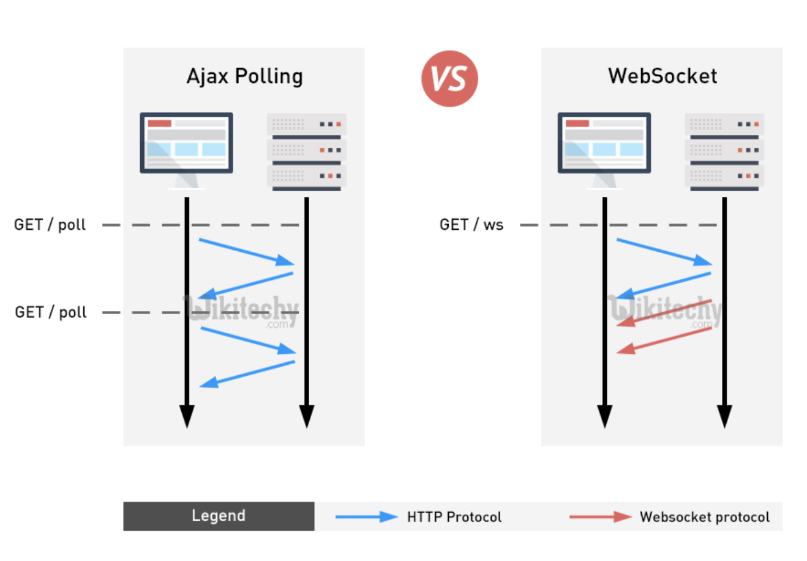

## 웹 브라우저에서의 양방향 통신

### ⚠️ 기존 http 프로토콜의 한계

기존 웹페이지에서 사용하는 http 프로토콜은 요청/응답 패러다임이기에 클라이언트에서 요청을 보내야만 그에 대한 응답을 받았다. http 프로토콜로 통신하는 경우, 특성상 stateless이기 때문에 연결이 유지되지 않아 **서버에서 먼저 요청을 보내는 것이 불가능**하다. 

### 🧤 http 의 대체 ⇒ `Polling` , `Long Polling` , `Streaming`

- **Polling**
    
    : 클라이언트에서 일정 주기마다 요청을 보내고 서버는 현재 상태를 바로 응답하는 방식
    
    🕶 이 방식은 불필요한 트래픽이 발생하기 때문에 실시간 데이터가 중요한 서비스에는 좋지 않다.
    
- **Long Polling (event 중심)**
    
    : 클라이언트에서 요청을 보내고 서버에서는 이벤트가 발생했을 때 응답을 내려준다. 그리고 클라이언트가 응답을 받았을 때 다시 다음 응답을 기다리는 요청을 보낸다.  
    
    🕶 이 방식은 실시간 반응이 가능하고 polling에 비해서 불필요한 트래픽은 유발하지 않지만 오히려 이벤트가 잦다면 순간적으로 과부화가 걸린다.
    
- **Streaming**
    
    : 이벤트가 발생했을 때 응답을 내려주는데 응답을 완료시키지 않고 계속 연결을 유지하는 방식
    
    🕶  이 방식은 연결시간이 길어질수록 연결의 유효성 관리의 부담이 발생한다. 대신 연결이 유지되어있기 때문에 응답마다 다시 요청을 보낼 필요는 없다.
    

### 🤙🏻 Websocket의 등장

HTML5에서 websocket의 개념이 등장하면서 서버-클라이언트간의 양방향 통신을 구현할 수 있게 되었다.

### 🤙🏻 Websocket이란?

웹 서버와 웹 브라우저간 실시간 양방향 통신환경을 제공해주는 실시간 통신 기술이다. 서버와 브라우저 간의 연결을 유지한 상태로 데이터 교환이 이루어진다. 

- 데이터 전달 단위 : 패킷(packet)
- 전송은 커넥션 중단과 추가 http 요청 없이 양방향으로 이뤄진다.

웹소켓은 온라인 게임이나 주식 트레이딩 시스템 같이 데이터 교환이 지속적으로 이뤄져야 하는 서비스에 아주 적합하다.



### 🤙🏻 Websocket 예시

웹소켓 커넥션을 만들려면 `new Websocket` 을 호출하면 되는데, 이때 `ws` 라는 특수 프로토콜을 사용한다.

```jsx
let socket = new WebSocket("ws://yurim22.github.io");
// ("ws://url 주소")
```

소켓이 정상적으로 만들어지면 아래 네 개의 이벤트를 사용할 수 있다.

- `open` - 커넥션이 제대로 만들어졌을 때 발생함
- `message` - 데이터를 **수신**하였을 때 발생함
- `error` - 에러가 생겼을 때 발생함
- `close` - 커넥션이 종료되었을 때 발생함

커넥션이 만들어진 상태에서 무언가를 보내고 싶으면 `socket.send(data)` 를 사용하면 됩니다.

```jsx
let socket = new WebSocket("wss://yurim22.github.io/websocket/demo/hello");

socket.onopen = function(e) {
	alert("[open] 커넥션이 만들어졌습니다.");
	alert("데이터를 서버에 전송해봅시다.");
	socket.send("My name is yurim");  //데이터 전송
}

socket.onclose = function(event) {
	if(event.wasClean) {
		alert(`[close] 커넥션이 정상적으로 종료되었습니다(code=${event.code} reason=${event.reason})`;
	} else {
		// 예시: 프로세스가 죽거나 네트워크에 장애가 있는 경우
		// event.code === 1006
		alert('[close] 커넥션이 죽었습니다.');
	}
};

socket.onerror = function(error) {
	alert(`[error] ${error.message}`);
};
```

서버쪽 코드가 동작하면서 `open` → `message` → `close` 순의 이벤트를 볼 수 있다.

### 참고

- [https://ko.javascript.info/websocket](https://ko.javascript.info/websocket)
- [http://www.secmem.org/blog/2019/08/17/websocket-socketio/](http://www.secmem.org/blog/2019/08/17/websocket-socketio/)